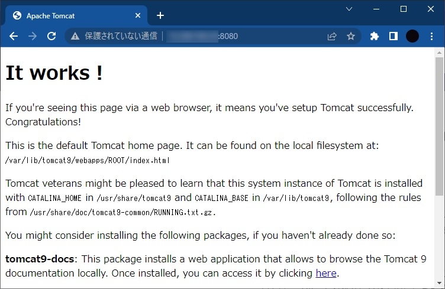
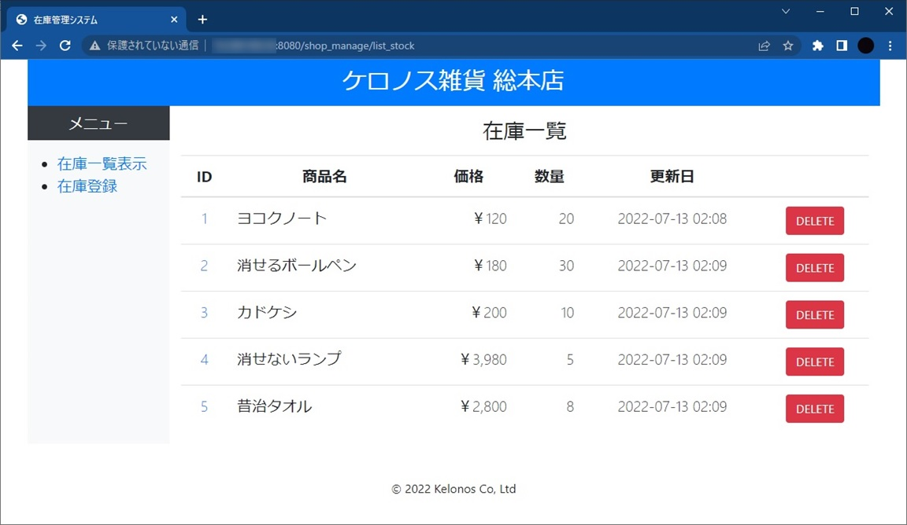

# Linux(Ubuntu)によるWebサーバ構築

### 0. 前提条件

AWSで以下のインスタンスを立てて、Webサーバの構築とWebアプリケーションのデプロイを実施する。

- タグ
    - 自分の番号_ubuntu_web
- AMI
    - Ubuntu Server 22.04 LTS
- インスタンスタイプ
    - t2.micro
- VPC
    - デフォルトのVPC
- サブネット
    - ap-northeast-1a
- セキュリティグループ
    - SSH（22）
    - HTTP（80）
    - カスタムTCP（8080）　※Tomcat確認用
- ストレージ
    - 8GiB

<br><br>

### 1. OpenJDK11(JRE)

#### 1.1. JREのインストール

インストール可能なパッケージを更新する。

```
$ sudo apt update
```

OpenJDK11（JRE）をインストールする。

```
$ sudo apt install -y openjdk-11-jre
```

バージョンを確認する。

```
$ java --version
openjdk 11.0.15 2022-04-19
OpenJDK Runtime Environment (build 11.0.15+10-Ubuntu-0ubuntu0.22.04.1)
OpenJDK 64-Bit Server VM (build 11.0.15+10-Ubuntu-0ubuntu0.22.04.1, mixed mode, sharing)
```

<br>

#### 1.2. 環境変数の設定

viコマンドでホームディレクトリ（~）にあるbashの設定ファイル（.bashrc）を開き、PATHを設定する。

```bash
# ~/.bashrc
export JAVA_HOME=$(dirname $(dirname $(readlink -f $(which java))))
export PATH=$PATH:$JAVA_HOME/bin
```

bashの設定を反映する。

```
$ source ~/.bashrc
```

環境変数JAVA_HOMEの設定値を確認する。

```
$ echo $JAVA_HOME
/usr/lib/jvm/java-11-openjdk-amd64
```

<br><br>

### 2. MySQL

#### 2.1. MySQL8.0のインストール

MySQL8.0をインストールする。

```
$ sudo apt install -y mysql-server
```

バージョンを確認する。

```
$ mysql --version
mysql  Ver 8.0.29-0ubuntu0.22.04.2 for Linux on x86_64 ((Ubuntu))
```

MySQLの起動状況を確認する。（緑丸でactiveになっていればOK）

```
$ systemctl status mysql
● mysql.service - MySQL Community Server
     Loaded: loaded (/lib/systemd/system/mysql.service; enabled; vendor preset: enabled)
     Active: active (running) since Tue 2022-07-19 09:29:42 UTC; 1min 44s ago
  (中略)
```

<br>

#### 2.2. rootユーザの設定

MySQLに接続する。

```
$ sudo mysql -uroot
```

ALTERコマンドでパスワードを設定する。

```sql
mysql> ALTER USER 'root'@'localhost' IDENTIFIED WITH mysql_native_password by 'P@ssw0rd';
Query OK, 0 rows affected (0.01 sec)
```

接続確認をするため、一度MySQLを抜ける。

```sql
mysql> exit
```

設定したパスワードでMySQLに接続できるか確認する。

```sql
$ mysql -u root -p
Enter password:
Welcome to the MySQL monitor.  Commands end with ; or \g.
Your MySQL connection id is 12
Server version: 8.0.29-0ubuntu0.22.04.2 (Ubuntu)

Copyright (c) 2000, 2022, Oracle and/or its affiliates.

Oracle is a registered trademark of Oracle Corporation and/or its
affiliates. Other names may be trademarks of their respective
owners.

Type 'help;' or '\h' for help. Type '\c' to clear the current input statement.

mysql>
```

<br>

必要なデータベース、テーブル、データを作成する。


<br><br>

### 3. Apache Tomcat

Apache Tomcat（以下、Tomcat）をインストールする。

```
sudo apt install -y tomcat9
```

サーバ起動時のサービス自動起動を有効にする。

```
sudo systemctl enable tomcat9
```

Tomcatの起動状況を確認する。（緑丸でactiveになっていればOK）

```
$ systemctl status tomcat9
● tomcat9.service - Apache Tomcat 9 Web Application Server
     Loaded: loaded (/lib/systemd/system/tomcat9.service; enabled; vendor preset: enabled)
     Active: active (running) since Thu 2022-07-14 09:26:27 UTC; 6min ago
  (中略)
```

<br>

`http://[パブリックIPアドレス]:8080`にアクセスし、Tomcatが正常に動作していることを確認する。



<br><br>

### 4. Webアプリケーションのデプロイ

ローカルPCでWARファイルを生成し、Linuxのホームディレクトリにファイルをコピーする。

> Tera TermのSSH SCP機能でローカルPCからサーバにファイルをコピーできる。

<br>

次のコマンドでWARファイルをTomcatのwebappsディレクトリに移動する。
```
$ sudo mv ~/shop_manage.war /var/lib/tomcat9/webapps
```

webappsディレクトリ内でWARファイルが展開されることを確認する。
```
$ ls /var/lib/tomcat9/webapps/
ROOT  shop_manage  shop_manage.war
```

<br>

`http://[パブリックIPアドレス]:8080/shop_manage/list_stock`にアクセスできることを確認する。



<br><br>

### 5. Apache HTTP Server

Apache HTTP Server（以下、Apache）をインストールする。

```
$ sudo apt install -y apache2
```

サーバ起動時のサービス自動起動を有効にする。

```
sudo systemctl enable apache2
```

Apacheの起動状況を確認する。

```
$ systemctl status apache2
● apache2.service - The Apache HTTP Server
     Loaded: loaded (/lib/systemd/system/apache2.service; enabled; vendor preset: enabled)
     Active: active (running) since Thu 2022-07-14 10:33:29 UTC; 2min 2s ago
  (中略)
```

<br><br>

### 6. Apache HTTP ServerとTomcatの連携

viコマンドで`/var/lib/tomcat9/conf/server.xml`を開き、Tomcatの無効化（コメントアウト）とAJPの有効化（アンコメント）するよう修正する。
```xml
<!--
<Connector port="8080" protocol="HTTP/1.1"
           connectionTimeout="20000"
           redirectPort="8443" />
-->

(中略)

<Connector protocol="AJP/1.3"
           address="0.0.0.0"
           port="8009"
           secretRequired="false"
           redirectPort="8443" />
```

> AJP（Apache Jserv Protocol）は、Apache HTTP ServerとApache Tomcatを連携する際に使用するプロトコル。AJPは、TomcatのAJPサーバポート（8009）とTCP経由で接続する。

Tomcatを再起動する。
```
$ sudo systemctl restart tomcat9
```

<br>

Apacheのモジュール（プロキシ機能）を有効にする。
```
$ sudo a2enmod proxy
$ sudo a2enmod proxy_ajp
```

viコマンドで`/etc/apache2/apache2.conf`を開き、以下を追記する。
```
ProxyPass / ajp://localhost:8009/
```

Apacheを再起動する。

```
$ sudo systemctl restart apache2
```

<br>

`http://[パブリックIPアドレス]/shop_manage/list_stock`にアクセスできることを確認する。


